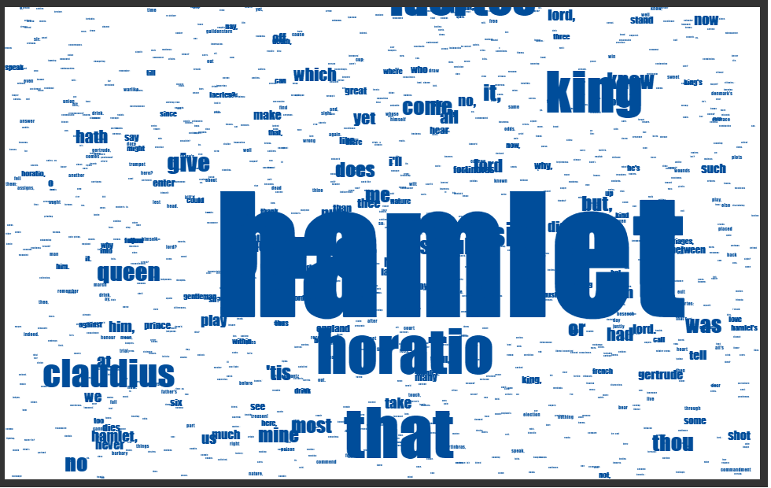

# Word Count in React
Word Count app deployed at this url:
[word count app](https://yzhang33.github.io/word-count/)

I am continuing my exploration in react and this week I created a word count app in react. 

I added a textArea where to take inputs and count button to display this visulation. With the time constriant and javascript limitation. I can only get this far. I also thought about using D3.js and writting the word cloud algorithm but it is too complicated for right now. It could be a start point for me where I can display word frequency. However, I will try to write word cloud where all the word forms a pattern and wihtout overlapping. 

## Few comments
* Writting code in react is different form P5. I feels like I wrote the text() method from P5 from bottom up. It took me something to figure out the things such as how to display text, font, color, and intensity.
* TF-IDF algorithm is very slow in my case. It's run time is O(2n^2) where n is number of words.I tried to wrote TF-IDF but my app will froze beacuse of the slow run time. Then I used something stupid but quick. I created a list of words that has low TF-IDF socre and remove them.
```javascript
 var removeList = ["the","i","to","and","of", "my", "in", "a", "is", "you", "this", "it", "his", "not","but", "", "be","me", "he", "your", "with","for", "let", "on", "what", "are", "if", "him", "from", "will", "have","by", "shall", "do", "would", "thy", "our", "how", "their", "they", "am", "very", "so"]
```
* The thing working for me is set the text intensity. I used 
```javascript
ctx.fillStyle = `rgb(0,77,154, ${intensity} )`;
```
but template literals in string not working for me for intensity. It will always be 1 for somereason. But I found the bug later. I set intensity in side display loop whcih made intensity always be 1.

* I did not know how to measure text's height in javascript. Maybe I should take a look at how p5 textHeight() was wrote. 

## Thoughts
D3 and wordle is much better solution for word count. The biggest limitation is the run time and remove the propsition and determiner. TF-IDF too slow for long document. I will try Bayesian Text Classification in the feture. It is a classification problem rather than counting problem. 

